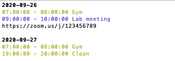

# terminalcal
Show your google calendar events in the command line (including Zoom links from the event description)

Optional arguments  
-d: maximum number of days ahead to check (0 checks until end of today, 1 until end of tomorrow, etc.)  
-e: maximum events to show (default 10)

(Cmd + DoubleClick) to open Zoom link from terminal

## Installation

1. git clone https://github.com/maxwellreynolds/terminalcal/

2. ''' pip install requirements.txt '''

3. Push "Enable the Google Calendar API in step 1 here:
https://developers.google.com/calendar/quickstart/python

Save "credentials.json" in the same directory as python script

4. python terminalcal.py
(will be an authorization step the first time running)

5. for easy access make an alias

On Mac:

- nano ~/.bash_profile (or vi ~/.bash_profile)
- In the bash profile add the line:

alias gcal = python <path/to/clcal.py>  
(restart terminal for alias to take effect)

Now simply type "gcal" into terminal

