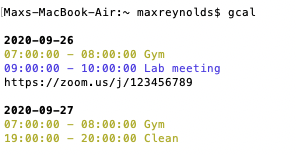

# clcal (command line calendar)
Show your Google Calendar events in the command line (including Zoom links from the event description)

## Showing upcoming events
Optional arguments  
-d: maximum number of days ahead to check (0 checks until end of today, 1 until end of tomorrow, etc.)  
-e: maximum events to show (default 10)





On Mac: (Cmd + DoubleClick) to open Zoom link from terminal

## Creating events
Arguments: <br>
--create, -c: create event <br>
--summary, -s: summary of event (aka name of event)<br>
--description, -d: description of event<br>
--startdate, sd: start date for created event. format as "today", "tomorrow", yyyy-mm-dd, or mm-dd (defaults to current year).<br>
--enddate, ed (optional): same format as --startdate<br>
--starttime, st: start time for event, format as hh:mm:ss or hh:mm <br>
--endtime (optional): end time for event, defaults to 1 hour after start if empty<br>

example:
```
gcal -c -s "test event" -sd tomorrow -st 13:00
```


## Installation

1. 
```
git clone https://github.com/maxwellreynolds/clcal/
```

2.
```
pip install -r requirements.txt
```

3.
Follow oauth client id credentials steps 1-3 for "Web App" here. https://developers.google.com/workspace/guides/create-credentials?authuser=3#web-application.

In the Google Cloud Platform "Create OAuth Client ID" step, select Desktop App 

Create name for project (any name should work)

Select "Download JSON", and download credentials as "credentials.json" in the same directory as this repository.

4. 
```
python clcal.py
```
(will be an authorization step the first time running)
Note: if you only want to give the app read priveleges (i.e. cannot create events, just shows them; change the line in clcal.py from 
```
SCOPES = ['https://www.googleapis.com/auth/calendar']
```
to 
```
SCOPES = ['https://www.googleapis.com/auth/calendar.readonly']
```


5.

for easy access make an alias

On Mac:

- nano ~/.bash_profile (or vi ~/.bash_profile)
- In the bash profile add the line:

alias gcal = python <path/to/clcal.py>  
(restart terminal for alias to take effect)


Now simply type "gcal" into terminal to list your next events or "gcal -c <args>..." to create an event

